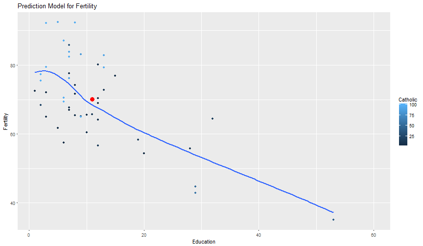

Predicting Fertility in XIX
========================================================
author: alatriste65
date: 07/04/2017
width: 1440
height: 950

Goal and Usage
========================================================
The App includes a prediction model for fertility based on swiss socio-economic indicators from end of XIX.
Instructions for usage can be found in the Tab "Instructions".

The prediction algorithm is embebbed in the App and so the User only needs to choose the values of Education and Catholic for which he wishes to obtain a fertility prediction for a swiss region in the XIX century. The user can choose the desired values interactivily through the respective sidebars in the "Prediction" Tab. The default values are 11% for the variable education and 41% for the variable catholic. 

The predicted fertility given input values for Education and Catholic will be displayed in the figure as red dot. 


Data
========================================================
The prediction algorithm is based on the "swiss" dataset, which includes fertility measures and socio-economic indicators for each of 47 French-speaking provinces in Switzerland. 

```r
data(swiss)
str(swiss)
```

```
'data.frame':	47 obs. of  6 variables:
 $ Fertility       : num  80.2 83.1 92.5 85.8 76.9 76.1 83.8 92.4 82.4 82.9 ...
 $ Agriculture     : num  17 45.1 39.7 36.5 43.5 35.3 70.2 67.8 53.3 45.2 ...
 $ Examination     : int  15 6 5 12 17 9 16 14 12 16 ...
 $ Education       : int  12 9 5 7 15 7 7 8 7 13 ...
 $ Catholic        : num  9.96 84.84 93.4 33.77 5.16 ...
 $ Infant.Mortality: num  22.2 22.2 20.2 20.3 20.6 26.6 23.6 24.9 21 24.4 ...
```

The model
========================================================
The model has been estimated using the lm method and has two regressors:
- Education represents the percentage of draftees with education beyond primary school
- Catholic: represents the percentage of catholics in the region

```

Call:
lm(formula = Fertility ~ Education + Catholic, data = swiss)

Residuals:
    Min      1Q  Median      3Q     Max 
-15.042  -6.578  -1.431   6.122  14.322 

Coefficients:
            Estimate Std. Error t value Pr(>|t|)    
(Intercept) 74.23369    2.35197  31.562  < 2e-16 ***
Education   -0.78833    0.12929  -6.097 2.43e-07 ***
Catholic     0.11092    0.02981   3.721  0.00056 ***
---
Signif. codes:  0 '***' 0.001 '**' 0.01 '*' 0.05 '.' 0.1 ' ' 1

Residual standard error: 8.331 on 44 degrees of freedom
Multiple R-squared:  0.5745,	Adjusted R-squared:  0.5552 
F-statistic:  29.7 on 2 and 44 DF,  p-value: 6.849e-09
```

The prediction
========================================================
The data used for fitting the model is displayed in a figure. The graphic is a scatterplot for the fertility (y-axis), education (x-axis) and catholic (included through colour) data from the swiss dataset. It also includes a smooth-line for the model fit. The figure also includes the predicted fertility indicator given the input values for education and catholic.




